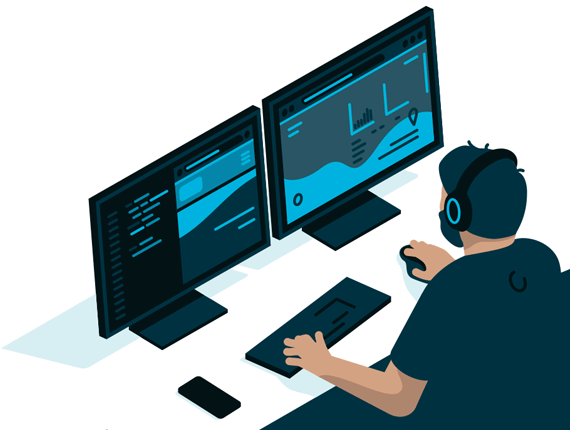

### Hi there 👋,

  

I am the one and only TryRaisins.

I'm a passionate learner who's always willing to learn and work across technologies and domains 💡. I love to explore new technologies and leverage them to solve real-life problems ✨. I'm currently into Web Development, specifically Frontend using ReactJS, Vue and NextJS frameworks.

If you'd love to collborate with or reach out to me, hit me up on any of my socials!

  
  
  

### :hammer_and_wrench: Languages and Tools :

  &nbsp;
  &nbsp;
  &nbsp;
  &nbsp;
  &nbsp;
  &nbsp;
  &nbsp;
   
  

<!--
**tryraisins/tryraisins** is a ✨ _special_ ✨ repository because its `README.md` (this file) appears on your GitHub profile.

Here are some ideas to get you started:

- 🔭 I’m currently working on ...
- 🌱 I’m currently learning ...
- 👯 I’m looking to collaborate on ...
- 🤔 I’m looking for help with ...
- 💬 Ask me about ...
- 📫 How to reach me: ...
- 😄 Pronouns: ...
- ⚡ Fun fact: ...
-->
